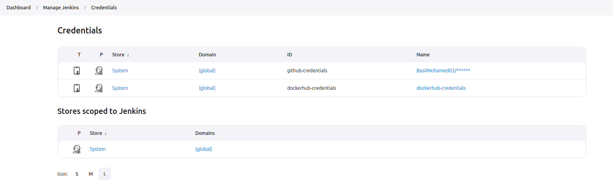
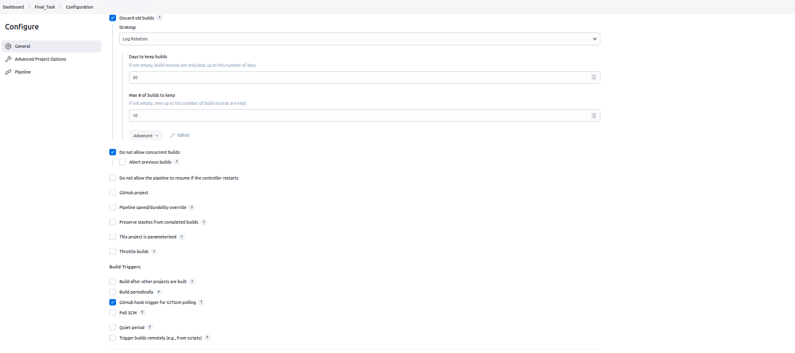
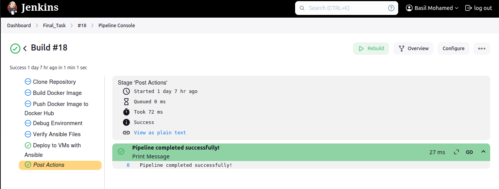
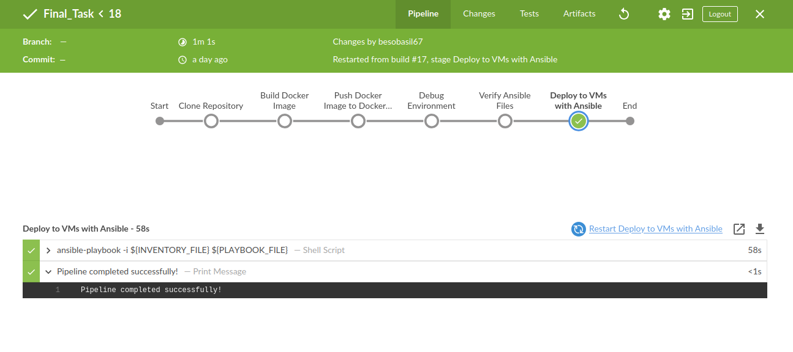
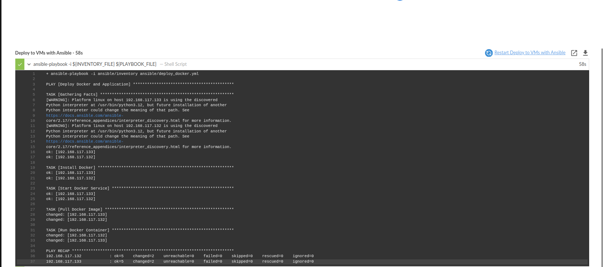
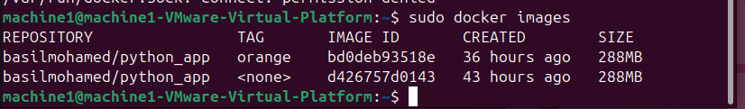
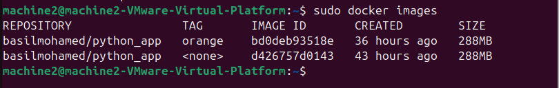

# Step-by-Step Guide: Setting Up and Running the Project

This document outlines the detailed steps taken to set up and run the project, including the configuration of Jenkins, Ansible, and Docker.

---

## Prerequisites

Before starting, ensure the following requirements are met:

1. **System Requirements:**

   - Ubuntu Linux for Jenkins and target VMs.
   - two target VMs with accessible IPs.

2. **Installed Tools:**

   - Jenkins installed and running.
   - Ansible installed on the Jenkins server.

3. **Credentials:**

   - SSH keys configured for passwordless access to the target VMs.
   - GitHub credentials for pulling the repository.
   - Docker Hub credentials for pushing/pulling Docker images.

---

## Project Setup

### 1. Jenkins Configuration

#### a. Install Jenkins Plugins

Install the following plugins in Jenkins (These tools are likely pre-installed):

- Pipeline
- Git
- SSH Agent
- Ansible Plugin

#### b. Configure Credentials

##### Jenkins Credentials


1. **GitHub Credentials:**

   - Add GitHub credentials (username/password or token) in Jenkins.

2. **Docker Hub Credentials:**

   - Add Docker Hub credentials Secret-Text (Recommended) or (username/password) in Jenkins.

3. **SSH Key for Target VMs:**

   - Add SSH private key in Jenkins credentials.

  
### 2. Configure SSH Access

1. Generate an SSH key for Jenkins:

```bash
   sudo -u jenkins ssh-keygen -t rsa -b 2048 -f /var/lib/jenkins/.ssh/id_rsa
   ```

2. Copy the public key to the target VMs:

```bash
   ssh-copy-id -i /var/lib/jenkins/.ssh/id_rsa.pub machine1@192.168.117.132
   ssh-copy-id -i /var/lib/jenkins/.ssh/id_rsa.pub machine2@192.168.117.133
   ```

3. Test SSH access:

```bash
   sudo -u jenkins ssh machine1@192.168.117.132
   sudo -u jenkins ssh machine2@192.168.117.133
   ```
### 3. Docker Configuration

 #### a. Create Docker file
``` dockerfile
# Use the official Python image
FROM python:3.9-slim

# Set the working directory
WORKDIR /app

# Copy requirements.txt and install dependencies
COPY requirements.txt .
RUN pip install --no-cache-dir -r requirements.txt

# Copy the application code
COPY . .

# Expose the application port
EXPOSE 5000

# Command to run the application
CMD ["python", "app.py"]
 ```
### 4. Ansible Configuration

#### a. Ansible Inventory File

Create the Ansible inventory file `inventory`:

```ini
[web]
192.168.117.132 ansible_user=machine1 ansible_become_password="Your-machine_password"
192.168.117.133 ansible_user=machine2 ansible_become_password="Your-machine_password"
```

#### b. Ansible Configuration File

Create the `ansible.cfg` file in the Ansible directory:

```ini
[defaults]
inventory = /home/your_username/ansible/inventory
private_key_file = /var/lib/jenkins/.ssh/id_rsa
host_key_checking = False
```

#### c. Ansible Playbook

Save the following Ansible playbook as `deploy_docker.yml`:

```yaml
---
- name: Deploy Docker and Application
  hosts: web
  become: yes

  tasks:
    - name: Install Docker
      apt:
        name: docker.io
        state: present
        update_cache: yes

    - name: Start Docker Service
      service:
        name: docker
        state: started
        enabled: yes

    - name: Pull Docker Image
      command: docker pull docker_username/image_name:tag

    - name: Run Docker Container
      command: >
        docker run -d --name app-container
        -p 80:80 docker_username/image_name:tag
```

## Jenkins Pipeline

Create the Jenkins pipeline using the following script:

```groovy
        pipeline {
    agent any

    environment {
        DOCKER_IMAGE = 'docker_username/image_name:tag'
        INVENTORY_FILE = 'ansible/inventory'
        PLAYBOOK_FILE = 'ansible/deploy_docker.yml'
    }

    stages {
        stage('Clone Repository') {
            steps {
                git branch: 'main',
                    credentialsId: 'github-credentials', 
                    url: 'https://github.com/your-username/repo-name.git'
            }
        }

        stage('Build Docker Image') {
            steps {
                sh 'docker build -t ${DOCKER_IMAGE} .'
            }
        }

        stage('Push Docker Image to Docker Hub') {
            steps {
                withCredentials([string(credentialsId: 'dockerhub-credentials', variable: 'DOCKER_PASSWORD')]) {
                    sh '''
                        echo "$DOCKER_PASSWORD" | docker login -u basilmohamed --password-stdin
                        docker push ${DOCKER_IMAGE}
                    '''
                }
            }
        }

       //optional Stage
stage('Debug Environment') {
    steps {
        sh 'env'
        sh 'cat ~/.ssh/known_hosts'
        sh 'ls -l ~/.ssh'
    }
}
       //optional Stage
stage('Verify Ansible Files') {
    steps {
        sh 'ls -l ansible'
        sh 'cat ansible/ansible.cfg'
    }
}


        stage('Deploy to VMs with Ansible') {
            steps {
                sh 'ansible-playbook -i ${INVENTORY_FILE} ${PLAYBOOK_FILE}'
            }
        }
    }

    post {
        success {
            echo 'Pipeline completed successfully!'
        }
        failure {
            echo 'Pipeline failed. Check logs for details.'
        }
    }
        }
```

---

## Push Files to GitHub

1. Initialize a Git repository (if not already initialized):

```bash
   git init
   ```

2. Add files to the repository:

```bash
   git add .
   ```

3. Commit the changes:

```bash
   git commit -m "Initial commit"
   ```

4. Push to the GitHub repository:

```bash
   git remote add origin https://github.com/username/repository.git
   git branch -M main
   git push -u origin main
   ```

---

## Troubleshooting

### Common Issues

1. **Permission Denied (SSH):**

   - Ensure the correct SSH key is configured.
   - Verify the `inventory` file path is correct.

2. **Docker Login Issues:**

   - Recheck Docker Hub credentials in Jenkins.

3. **Pipeline Errors:**

   - Validate the paths to Ansible files and ensure they exist.

### Debugging Tips

- Run `ansible-playbook` locally to verify connectivity.
- Use `ssh -v` for detailed SSH debugging.
- Check Jenkins logs for detailed pipeline errors.

---

## Screenshots
### Jenkins General Configuration
 

 ### pipeline console output
 
 

 ### Ansible_execution
 

 ### Two machine images
  #### Machine1
   
  #### Machine2
   
